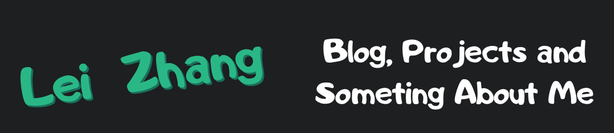

# Hey there 

My name is Lei Zhang!

- 🔭 I’m Front-end engineer, currently working on Wuhan.
- 🌱 I enjoy building tool, writing documentation, and CI/CD to improve developer experience.
- 🤔 I’m looking for help with how to be a good father.
- ⚡ My baby is one year old！

### Lei Zhang's Blog & Writing

Apart from coding, I also maintain a blog - you can find my articles on my website at [lovchun.com](https://www.lovchun.com/).

It was build with Nextjs & MDX, Deployed on Vercel,

I refactored this website in 2023,

Now it's build with Astro & MD.

### Lei Zhang's Techologies

